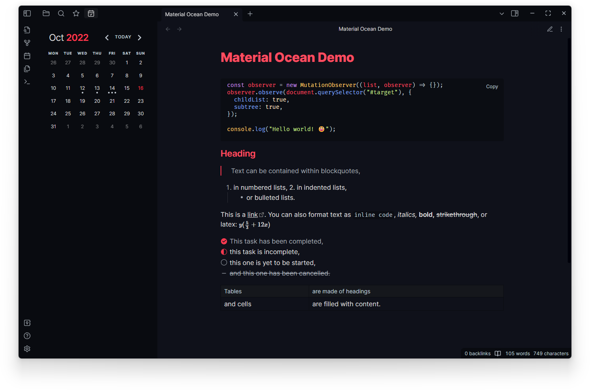

**Material Ocean** is an [Obsidian](https://obsidian.md/) dark theme that combines
navy blue undertones with pinky red highlights for a pleasant visual experience.

This theme is also available for use with [Visual Studio Code](https://marketplace.visualstudio.com/items?itemName=Equinusocio.vsc-material-theme), [Notion](https://notion-enhancer.github.io), and [a variety of other apps and desktop environments](https://github.com/material-ocean/Material-Ocean).

## Manual Installation

1. Download this repository.
2. Copy it into your vault's `.obsidian/themes` directory.
3. In Obsidian, navigate to **Settings** → **Appearance**.
4. Select `Material Ocean` from the dropdown under the **Themes** option.
5. You're done! 🎉

## Features

As well as recolouring Obsidian's interface,
the **Material Ocean** theme comes with a number of layout tweaks
and quality of life editor improvements.

- Tables now expand to the full width of the page.
- Line heights and element margins/padding/positioning have been
  adjusted to handle layout inconsistencies and off-centre elements.
- Code blocks are now horizontally scrollable and code is no longer
  wrapped onto the next line.

  > _Note: in reading mode, this applies to full code blocks. In source mode, only individual lines are horizontally scrollable due to architectural limitations of the editor._

- The default window minimize/maximise/close icons have been replaced with
  icons from the [Feather Icons](https://feathericons.com/) set, to match
  the smoother designs of the other in-app icons.
- The following alternative checkbox styles have been added:
  - `- [/]` represents an incomplete task with a half-filled circle.
  - `- [-]` represents a cancelled task by crossing it out.

## Supported Plugins

Most Obsidian plugins should work with this theme out of the box.
Additional styling has been provided specifically for the
[Calendar](https://github.com/liamcain/obsidian-calendar-plugin)
and [Dictionary](https://github.com/phibr0/obsidian-dictionary) plugins
to ensure compatibility.

## Disclaimer

This theme is provided as-is and is designed for personal use. It has not
been thoroughly tested and may not work as expected with all future updates.

If you notice something looks wrong, please open a bug report or pull request
so it can be fixed. I will try my best to help but may not always be available.
