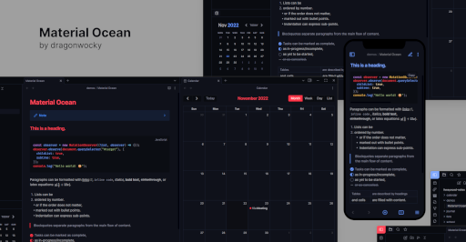

**Material Ocean** is an [Obsidian](https://obsidian.md/) dark theme that combines
navy blue undertones with pastel highlights for a pleasant visual experience on both
mobile and desktop. The recommended accent colours for this theme are either `#ff475a`
(the default) or `#82aaff` (sky blue) and the fonts used in the theme's screenshots are
[Inter](https://rsms.me/inter/) and [Fira Code](https://github.com/tonsky/FiraCode).

This theme is also available for [Visual Studio Code](https://marketplace.visualstudio.com/items?itemName=Equinusocio.vsc-material-theme), [Notion](https://notion-enhancer.github.io), and [a variety of other apps and desktop environments](https://github.com/material-ocean/Material-Ocean).

## Configuration

## Installation

### Obsidian Marketplace (Coming Soon)

1. In Obsidian, navigate to **Settings** → **Appearance**.
2. Press the **Manage** button beside the **Themes** option.
3. Search for `Material Ocean` in the **Filter** text input.
4. Select `Material Ocean` and press **Install and use**.
5. You're done! 🎉

### Manual

1. Download this repository.
2. Copy it into your vault's `.obsidian/themes` directory.
3. In Obsidian, navigate to **Settings** → **Appearance**.
4. Select `Material Ocean` from the dropdown under the **Themes** option.
5. You're done! 🎉

## Features

As well as recolouring Obsidian's interface,
the **Material Ocean** theme comes with a number of layout and typography
tweaks and quality of life editor improvements.

- Element spacing, sizing and positioning has been adjusted for a more
  consistent editing experience.
- **The window minimise/maximise/close button icons are replaced**
  by icons from the [Lucide](https://lucide.dev/) icons toolkit, matching
  the smoother and more rounded designs of the other in-app icons
- **The top-left sidebar toggle button has been accented** and the surrounding
  borders simplified and rounded for a more aesthetic design.
- **Long code lines overflow and are scrolled horizontally** instead of being wrapped
  onto the next line. In reading mode, whole code blocks can be scrolled. In source
  mode, individual lines must be scrolled due to architectural limitations.
- **Images are (slightly) rounded, headings are underlined** and callout arrows
  are right-aligned.
- **Checkboxes are circular** and completed tasks are greyed out instead
  of crossed out. The following alternative checkbox styles have been added:
  - **`- [/]` represents an incomplete task** with a half-filled circle.
  - **`- [-]` represents a cancelled task** by crossing it out.

## Supported Plugins

Most Obsidian plugins should work with this theme out of the box.
Additional styling has been provided specifically for the following
plugins to ensure compatibility and fix minor display issues:

- [Calendar](https://github.com/liamcain/obsidian-calendar-plugin)
- [Full Calendar](https://github.com/davish/obsidian-full-calendar)
- [Dictionary](https://github.com/phibr0/obsidian-dictionary)
- [Self-hosted Livesyync](https://github.com/vrtmrz/obsidian-livesync)

## Disclaimer

This theme is provided as-is and is designed for personal use. It has not
been thoroughly tested and may not work as expected with all future updates.

If you notice something looks wrong, please open a bug report or pull request
so it can be fixed.
